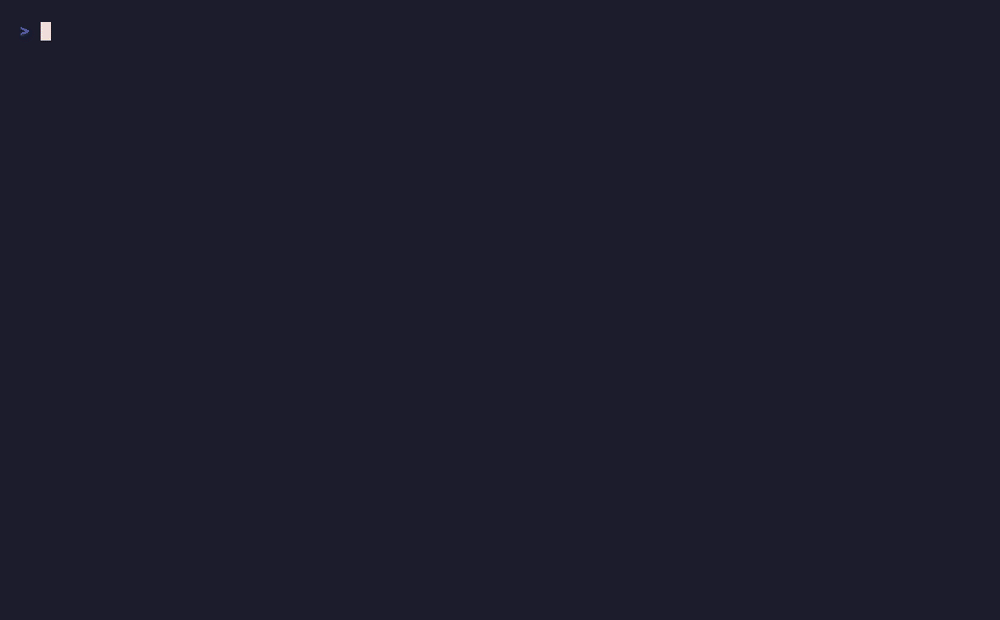

<p align="center">
<pre>
                                                                                      ..
                                                                                    :*##+.
             :***+.                                                                =%%%#: .-==-.
             -%%%%=        .::-----:.    .:::::::::: .:--:    .:--:.   .:-----:.    .-==:  .#%%%+
             -%%%%-        +%%%%%%%%#*:  +%%%%%%%%%%::%%%%=   -%%%%: :+#%%%%%%%#*-  -%%%#: .#%%%#***-
             -%%%%-        :---:-=#%%%#. :---=#%%%%+. +%%%%: .*%%%#..#%%%*-::*%%%*  =%%%%: .#%%%#***-
             -%%%%-       .-+*####%%%%#.   .=#%%%+:   .#%%%*.=%%%%- -%%%%-   +%%%*  =%%%%: .#%%%+
             -%%%%=...... =%%%%=::+%%%#. .=#%%%*-....  :#%%%+#%%%=  .#%%%*---#%%%*  =%%%%: .#%%%*...
             -%%%%%%%%%%#.-#%%%***#%%%*. +%%%%%####%=   :*%%%%%%+.   :+#%%%%%%%%%*  =%%%%: .+%%%%###-
             .-+++++++++=. .-+*****+=-.  :++++++++++:    -#%%%%=     .:::----#%%%+  .++++.  .-+****+:
                                                       -#%%%%*:      -%%##*#%%%%*:
                                                       :=+++-.       .-=+****+=:.
</pre>
</p>

<p align="center">
  <strong>손으로 직접 배우는 lazygit | Learn lazygit by doing</strong>
</p>

<p align="center">
  <a href="https://github.com/ywc0008/lazygit-tutorial/stargazers"></a>
  <a href="LICENSE"></a>
  
  
  <a href="https://github.com/jesseduffield/lazygit"></a>
</p>

<p align="center">
  읽는 튜토리얼이 아닙니다. <strong>직접 해보는</strong> 튜토리얼입니다.<br>
  Not a reading tutorial. A <strong>hands-on</strong> tutorial.
</p>

---

## Demo

<p align="center">
  
</p>

---

## Quick Start

```bash
git clone https://github.com/ywc0008/lazygit-tutorial.git
cd lazygit-tutorial
./tutorial.sh
```

3줄이면 시작할 수 있습니다. That's it. Three lines to start learning.

### Prerequisites / 사전 요구사항

| Tool | Install | Required |
|------|---------|:--------:|
| `git` 2.23+ | (already installed on most systems) | Yes |
| `lazygit` | `brew install lazygit` | Yes |
| `python3` + PyYAML | `pip3 install pyyaml` | Yes |

> **lazygit 설치 가이드**: [macOS](https://github.com/jesseduffield/lazygit#homebrew) / [Linux](https://github.com/jesseduffield/lazygit#installation) / [Windows](https://github.com/jesseduffield/lazygit#scoop)

---

## Lessons / 레슨 목록

### Beginner / 초급

| # | Lesson | 레슨 | Steps |
|:-:|--------|------|:-----:|
| 01 | UI Navigation | UI 패널 탐색하기 | 1 |
| 02 | Staging & Commit | 파일 스테이징과 커밋 | 1 |
| 03 | Branching | 브랜치 만들고 전환하기 | 2 |
| 04 | Push & Pull | Push와 Pull | 2 |
| 05 | Diff Viewing | Diff 확인하기 | 2 |

### Intermediate / 중급

| # | Lesson | 레슨 | Steps |
|:-:|--------|------|:-----:|
| 06 | Merge Conflicts | 머지 충돌 해결하기 | 1 |
| 07 | Stash | Stash 사용하기 | 2 |
| 08 | Interactive Rebase | 인터랙티브 리베이스 | 1 |
| 09 | Cherry-pick | Cherry-pick | 1 |

### Advanced / 고급

| # | Lesson | 레슨 | Steps |
|:-:|--------|------|:-----:|
| 10 | Worktree | Worktree | 1 |
| 11 | Patch Building | 패치 빌딩 (부분 스테이징) | 1 |
| 12 | Bisect | Bisect로 버그 찾기 | 1 |
| 13 | Custom Commands | 커스텀 명령어 설정 | 1 |

---

## How It Works / 작동 원리

```
  setup.sh                    You                      check.sh
  ────────                 ────────                   ──────────
  Creates isolated    →    Practice with     →    Automatically verifies
  Git scenario             lazygit                 your work
```

1. **Setup** — `setup.sh`가 `/tmp/lazygit-tutorial/`에 격리된 Git 시나리오를 생성합니다
2. **Practice** — lazygit을 열고 직접 실습합니다
3. **Verify** — `check.sh`가 결과를 자동 검증하고 피드백을 줍니다

> Your real Git repositories are never touched. 실제 저장소는 절대 건드리지 않습니다.

---

## Usage / 사용법

```bash
./tutorial.sh                    # Show lesson list / 레슨 목록
./tutorial.sh start 3            # Start lesson 3 / 레슨 3 시작
./tutorial.sh --lang ko          # Korean / 한국어
./tutorial.sh --lang en          # English / 영어
./tutorial.sh reset              # Reset progress / 초기화
```

The tutorial automatically detects your system locale (한국어/English).

---

## Language Support / 언어 지원

- **한국어** (Korean) — 네이티브 지원
- **English** — Full support

`--lang ko` 또는 `--lang en`으로 언어를 강제 설정할 수 있습니다.

Adding a new language? Just create `lesson.<lang>.yaml` files for each lesson.

---

## Contributing / 기여하기

```
lessons/XX-lesson-name/
├── setup.sh          # Creates the practice scenario
├── check.sh          # Verifies completion
├── lesson.en.yaml    # English instructions
└── lesson.ko.yaml    # Korean instructions
```

We welcome contributions! 기여는 언제나 환영합니다!

- New lessons / 새 레슨
- Translations / 번역
- Bug fixes / 버그 수정
- Suggestions / 제안

---

<p align="center">
  If this helped you learn lazygit, please consider giving it a ⭐<br>
  lazygit 학습에 도움이 되었다면 ⭐ 를 눌러주세요
</p>

---

## License

[MIT](LICENSE)
